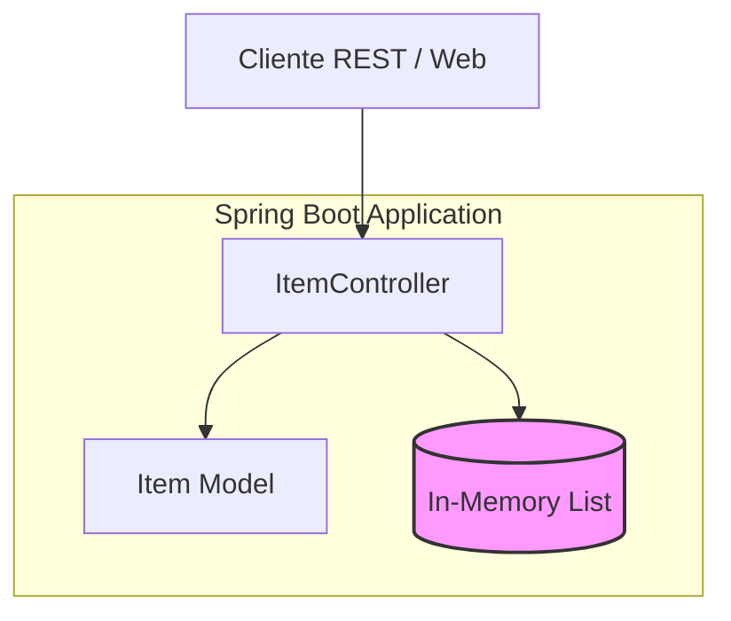

# API REST de Gestión de Ítems (restful-service)

## Introducción
Este proyecto es un servicio backend RESTful robusto desarrollado con Java 21 y Spring Boot. Su propósito fundamental es proporcionar una interfaz programática para la gestión de "Ítems", permitiendo realizar operaciones CRUD (Crear, Leer, Actualizar y Borrar) de manera eficiente. El servicio está diseñado siguiendo las mejores prácticas de desarrollo, incluyendo validación de datos de entrada y pruebas unitarias automatizadas para garantizar la integridad del sistema.

## Características Principales
*   **API RESTful Completa**: Endpoints estandarizados para la gestión del ciclo de vida de los recursos.
*   **Validación de Datos**: Implementación de reglas de negocio mediante anotaciones de `jakarta.validation` (ej. `@NotBlank`) para asegurar que los datos recibidos sean válidos.
*   **Persistencia en Memoria**: Gestión de estado mediante estructuras de datos optimizadas en memoria, facilitando pruebas rápidas y despliegues ligeros.
*   **Calidad de Código**: Cobertura de pruebas unitarias utilizando `MockMvc` para validar el comportamiento de los controladores y la lógica de validación.
*   **Carga Inicial**: Sistema de inicialización automática de datos (`@PostConstruct`) para facilitar las pruebas de desarrollo.

## Arquitectura del Sistema
El proyecto sigue una arquitectura monolítica simplificada de capas, centrada en la separación de responsabilidades entre la definición del modelo de datos y la exposición de servicios web.



**Descripción del flujo:**
1.  El **Controlador** (`ItemController`) recibe las peticiones HTTP y gestiona las rutas.
2.  Se aplican **Validaciones** automáticas sobre el **Modelo** (`Item`) antes de procesar cualquier cambio.
3.  Los datos se almacenan y manipulan en una lista sincronizada dentro del contexto de la aplicación.

## Tecnologías Utilizadas
*   **Lenguaje**: Java 21 (LTS).
*   **Framework Principal**: Spring Boot 4.0.6.
*   **Gestión de Dependencias**: Maven.
*   **Validación**: Spring Boot Starter Validation (Jakarta Bean Validation).
*   **Pruebas**: JUnit 5 y Spring Boot Test (MockMvc).
*   **Herramientas**: Spring Boot DevTools para agilizar el desarrollo.

## Documentación de la API
La API está estructurada bajo el path base `/api/items`. A continuación, se detallan los endpoints principales:

| Método | Endpoint | Descripción |
| :--- | :--- | :--- |
| `GET` | `/api/items` | Obtiene la lista completa de ítems. |
| `GET` | `/api/items/{id}` | Obtiene el detalle de un ítem específico por su ID. |
| `POST` | `/api/items` | Crea un nuevo ítem (Requiere `name` y `description`). |
| `PUT` | `/api/items/{id}` | Actualiza un ítem existente. |
| `DELETE` | `/api/items/{id}` | Elimina un ítem del sistema. |

### Ejemplo de petición POST:
```json
URL: /api/items
Content-Type: application/json

{
    "name": "Nuevo Ítem",
    "description": "Descripción detallada del producto"
}
```