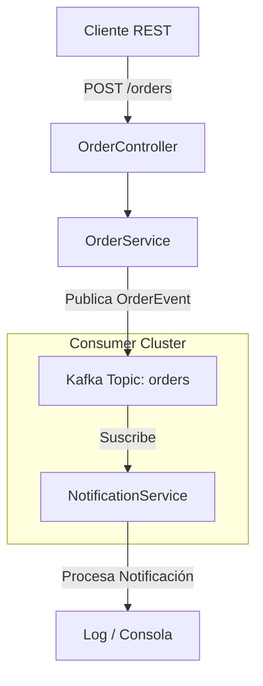

# Sistema de Procesamiento de Órdenes con Kafka 

## Introducción
Este proyecto es un microservicio desarrollado con Java 17 y Spring Boot que implementa un flujo de procesamiento de órdenes basado en eventos. Utiliza Apache Kafka como intermediario de mensajería para desacoplar la creación de órdenes de la lógica de notificación, garantizando un sistema altamente escalable, resistente y con baja latencia en la respuesta al cliente.

## Características Principales
*   **Comunicación Basada en Eventos**: Implementación del patrón Productor-Consumidor utilizando Apache Kafka.
*   **Procesamiento Asíncrono**: Desacoplamiento total entre la recepción de la orden y el envío de notificaciones.
*   **Serialización JSON Avanzada**: Configuración de `JacksonJsonSerializer` y `JacksonJsonDeserializer` para el intercambio de objetos `OrderEvent` de forma transparente.
*   **Infraestructura como Código**: Configuración de Kafka lista para usar mediante Docker Compose (Confluent Platform).
*   **Gestión de DTOs**: Separación clara entre modelos de solicitud, respuesta y eventos de dominio.
*   **Configuración Flexible**: Uso de perfiles y propiedades externas para servidores bootstrap y grupos de consumidores.

## Arquitectura del Sistema
El microservicio sigue una arquitectura orientada a eventos (EDA). El flujo comienza en un controlador REST que actúa como productor de mensajes, enviando eventos a un tópico de Kafka, los cuales son procesados de forma independiente por un servicio de notificaciones (consumidor).



**Descripción del flujo:**
1.  El `OrderController` recibe una solicitud de creación.
2.  El `OrderService` genera un `OrderEvent` con estado `CREATED` y lo envía al tópico `orders`.
3.  El sistema responde inmediatamente al cliente con un `201 Created`.
4.  El `NotificationService` detecta el nuevo evento en Kafka y lo procesa de manera asíncrona.

## Tecnologías Utilizadas
*   **Lenguaje**: Java 17.
*   **Framework**: Spring Boot 4.0.6.
*   **Mensajería**: Apache Kafka (v7.6.0 via Confluent).
*   **Contenedores**: Docker & Docker Compose.
*   **Serialización**: Jackson (JSON).
*   **Herramientas de Construcción**: Maven 3.9.16.

## Documentación de la API
La API se encuentra disponible por defecto en el puerto `8080`.

### Endpoints Principales

| Método | Endpoint | Descripción |
| :--- | :--- | :--- |
| `POST` | `/orders` | Crea una nueva orden e inicia el proceso asíncrono. |
| `GET` | `/orders/{id}` | Recupera el estado y detalles de una orden específica. |

### Ejemplo de Petición (Crear Orden)

**URL**: `http://localhost:8080/orders`  
**Cuerpo (JSON)**:
```json
{
    "orderId": "ORD-5521"
}
```

**Respuesta**:
El sistema retornará un objeto con el ID de la orden, el estado actual y un timestamp de la operación.