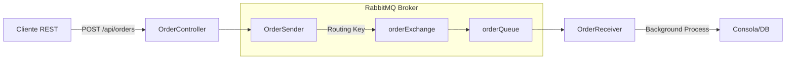

# Sistema de Procesamiento Asíncrono de Órdenes (synch-asynch)

## Introducción
Este proyecto es un microservicio desarrollado en Java 21 con Spring Boot diseñado para demostrar la transición de una comunicación síncrona a una asíncrona. El servicio expone una API REST para recibir órdenes de compra, las cuales son inmediatamente encoladas en un broker de mensajería (RabbitMQ) para su procesamiento en segundo plano, permitiendo así una respuesta instantánea al cliente y un desacoplamiento efectivo entre la ingesta y el procesamiento de datos.

## Características Principales
*   **Desacoplamiento de Procesos**: Separación clara entre el productor de mensajes (`OrderSender`) y el consumidor (`OrderReceiver`).
*   **Comunicación Asíncrona**: Uso de RabbitMQ para gestionar colas de mensajes de forma duradera.
*   **Serialización JSON**: Configuración de `JacksonJsonMessageConverter` para el intercambio de datos en formato JSON en lugar de la serialización nativa de Java.
*   **Arquitectura Orientada a Eventos**: Implementación de `TopicExchange` para permitir un enrutamiento de mensajes flexible y escalable.
*   **Respuesta Rápida (Non-blocking logic)**: El controlador responde con un estado HTTP 202 (Accepted) sin esperar a que la lógica de negocio finalice.

## Arquitectura del Sistema
El sistema utiliza un patrón de Productor-Consumidor mediado por un Message Broker.



**Flujo de ejecución:**
1.  El `OrderController` recibe un objeto `Order`.
2.  `OrderSender` publica el objeto en el Exchange `orderExchange`.
3.  RabbitMQ enruta el mensaje a la cola `orderQueue` basándose en la clave `orderRoutingKey`.
4.  `OrderReceiver` escucha la cola y procesa el mensaje de forma asíncrona (simulando una latencia de 50ms).

## Tecnologías Utilizadas
*   **Lenguaje**: Java 21 (LTS).
*   **Framework**: Spring Boot 4.0.6 (Spring AMQP).
*   **Mensajería**: RabbitMQ.
*   **Serialización**: Jackson (JSON).
*   **Gestor de Dependencias**: Maven (incluye `mvnw` wrapper).
*   **Pruebas**: Spring Rabbit Test y JUnit 5.

## Documentación de la API
La API es minimalista y está centrada en la recepción de órdenes.

### Endpoint Principal
*   **URL**: `/api/orders`
*   **Método**: `POST`
*   **Descripción**: Recibe una nueva orden y la encola para procesamiento.
*   **Respuesta Exitosa**: `202 Accepted` - "Orden recibida y encolada para su procesamiento asincrono".

### Ejemplo de Payload (JSON)
```json
{
    "id": 101,
    "name": "Orden de prueba de microservicios"
}
```

Para visualizar el procesamiento, revise los logs de la aplicación donde el `OrderReceiver` imprimirá los detalles de la orden recibida una vez sea consumida del broker.